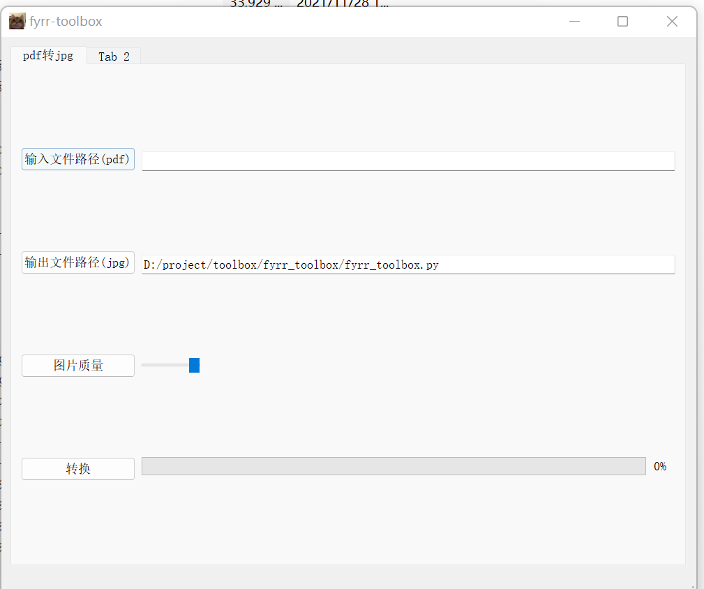

#TOOLBOX
It's a toolbox for dealing things, currently it support pdf2jpg conversion and will add more tools.

#Prerequisites
you need to install python3 and pyqt5

#Usage

select the file for input and press the transform button

